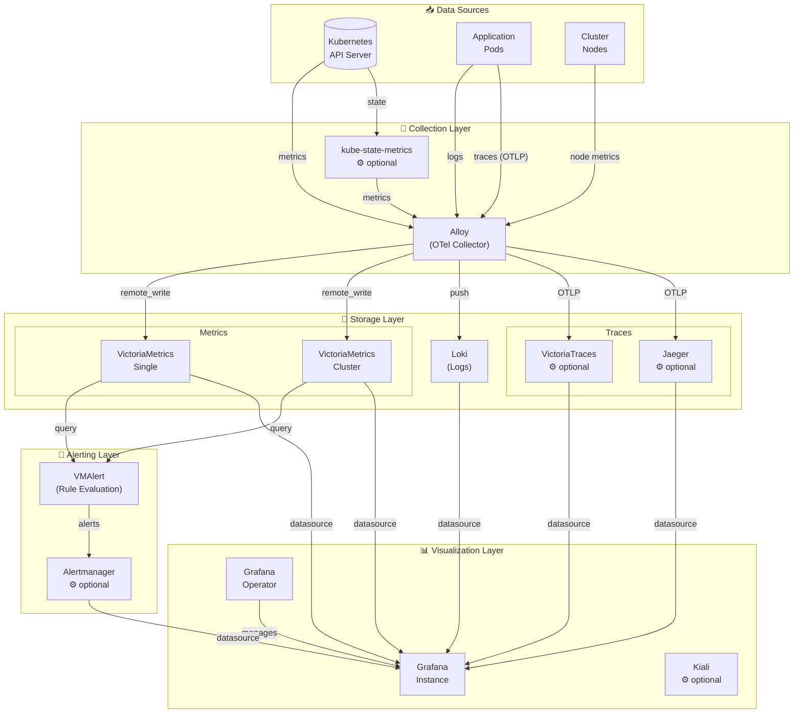

# k8s-observability-stack

[](https://github.com/theorigamicorporation/k8s-observability-stack/actions/workflows/lint-test.yaml)
[](https://github.com/theorigamicorporation/k8s-observability-stack/actions/workflows/release.yaml)
[](LICENSE)
[](https://artifacthub.io/packages/search?repo=k8s-observability-stack)

A complete, production-ready Kubernetes observability stack with VictoriaMetrics, Loki, Grafana Operator, and more. This chart serves as a modern replacement for `kube-prometheus-stack` and `kube-victoriametrics-stack` with enhanced support for larger clusters, service mesh integration, and distributed tracing.

---

## 📑 Table of Contents

- [Overview](#-overview)
- [Architecture](#-architecture) | [Detailed Diagrams](docs/architecture.md)
- [Features](#-features)
- [Prerequisites](#-prerequisites)
- [Quick Start](#-quick-start)
- [Installation](#-installation)
- [Configuration](#%EF%B8%8F-configuration)
- [Components](#-components)
- [GitOps Deployment](#-gitops-deployment)
- [Upgrading](#-upgrading)
- [Local Development](#-local-development)
- [Troubleshooting](#-troubleshooting)
- [Contributing](#-contributing)
- [Acknowledgments](#-acknowledgments)
- [Roadmap](#-roadmap)
- [License](#-license)

---

## 🔭 Overview

The k8s-observability-stack is an umbrella Helm chart that deploys a complete observability solution for Kubernetes clusters. It integrates best-in-class open-source tools for metrics, logs, and traces collection, storage, and visualization.

### Why This Chart?

| Benefit | Description |
|---------|-------------|
| 📦 **Unified Installation** | Deploy your entire observability stack with a single Helm chart |
| 🏭 **Production-Ready** | Pre-configured with best practices for alerting, dashboards, and retention |
| 📈 **Scalable** | Support for both single-node and cluster modes for metrics and tracing backends |
| 🔄 **GitOps-Friendly** | Uses Grafana Operator for CRD-based management of datasources and dashboards |
| ⚡ **Auto-Configuration** | Automatic datasource and service connection setup based on enabled components |

---

## 🏗️ Architecture



> 📘 **Note**: Components marked with ⚙️ are optional and disabled by default. For detailed architecture diagrams including data flow, alert sequences, and component dependencies, see [docs/architecture.md](docs/architecture.md).

### Data Flow

| Step | Flow |
|------|------|
| 📊 **Metrics** | Alloy scrapes metrics from Kubernetes components and applications → VictoriaMetrics |
| 📝 **Logs** | Alloy collects container logs → Loki |
| 🔍 **Traces** | Applications send traces via OTLP → Alloy → VictoriaTraces or Jaeger |
| 🚨 **Alerting** | VMAlert evaluates rules against VictoriaMetrics → Alertmanager |
| 👁️ **Visualization** | Grafana queries all backends with auto-configured datasources |

---

## ✨ Features

### 📊 Metrics
- VictoriaMetrics for efficient time-series storage (single or cluster mode)
- Pre-configured Kubernetes and node monitoring
- Recording rules for optimized queries
- Long-term retention support

### 📝 Logs
- Loki for log aggregation
- Automatic container log collection via Alloy
- Log-to-trace correlation

### 🔍 Traces
- VictoriaTraces or Jaeger for distributed tracing
- OTLP receiver support
- Trace-to-log and trace-to-metrics correlation

### 📈 Visualization
- Grafana Operator for CRD-based management
- Auto-configured datasources
- Pre-built dashboards from community mixins
- Custom dashboard support

### 🚨 Alerting
- VMAlert for rule evaluation
- Alertmanager for alert routing
- Pre-configured Kubernetes alerts
- Customizable alert rules

---

## 📋 Prerequisites

| Requirement | Version |
|-------------|---------|
| Kubernetes | 1.25+ |
| Helm | 3.10+ |
| kubectl | Configured for your cluster |
| jsonnet-bundler | (Optional) For mixins |

---

## 🚀 Quick Start

```bash
# Add the Helm repository
helm repo add k8s-observability https://theorigamicorporation.github.io/k8s-observability-stack
helm repo update

# Install with default configuration
helm install observability k8s-observability/k8s-observability-stack \
  --namespace observability \
  --create-namespace

# Access Grafana
kubectl port-forward svc/observability-k8s-observability-stack-grafana-service 3000:3000 -n observability
# Open http://localhost:3000
```

---

## 📥 Installation

### Basic Installation

```bash
helm install observability k8s-observability/k8s-observability-stack \
  --namespace observability \
  --create-namespace
```

### Installation with Custom Values

```bash
# Create a values file
cat > my-values.yaml << EOF
global:
  clusterName: "production-cluster"

victoriametrics:
  mode: "cluster"  # Use cluster mode for production

# Enable optional components
alertmanager:
  enabled: true
  config:
    receivers:
      - name: 'slack'
        slack_configs:
          - channel: '#alerts'
            api_url: 'https://hooks.slack.com/services/xxx'

kube-state-metrics:
  enabled: true
EOF

# Install with custom values
helm install observability k8s-observability/k8s-observability-stack \
  -f my-values.yaml \
  --namespace observability \
  --create-namespace
```

### 🏭 Production Installation

For production environments, consider enabling additional components:

```yaml
# production-values.yaml
global:
  clusterName: "production"
  storageClass: "fast-ssd"

victoriametrics:
  mode: "cluster"

vmcluster:
  vmselect:
    replicaCount: 3
  vminsert:
    replicaCount: 3
  vmstorage:
    replicaCount: 3
    persistentVolume:
      enabled: true
      size: 100Gi
    retentionPeriod: 90d

loki:
  deploymentMode: simple-scalable

# Optional components for production
alertmanager:
  enabled: true
  persistence:
    enabled: true
    size: 10Gi

kube-state-metrics:
  enabled: true

victoriatraces:
  enabled: true  # If you need distributed tracing
```

---

## ⚙️ Configuration

### Global Settings

| Parameter | Description | Default |
|-----------|-------------|---------|
| `global.clusterName` | Cluster name for labeling | `""` |
| `global.storageClass` | Default storage class | `""` |
| `global.commonLabels` | Labels applied to all resources | `{}` |

### Component Toggles

| Parameter | Description | Default | Status |
|-----------|-------------|---------|--------|
| `grafana-operator.enabled` | Enable Grafana Operator | `true` | 🟢 Core |
| `grafana.instance.enabled` | Create Grafana instance | `true` | 🟢 Core |
| `loki.enabled` | Enable Loki | `true` | 🟢 Core |
| `alloy.enabled` | Enable Alloy collector | `true` | 🟢 Core |
| `victoriametrics.mode` | VM mode: "single" or "cluster" | `"single"` | 🟢 Core |
| `kube-state-metrics.enabled` | Enable kube-state-metrics | `false` | ⚙️ Optional |
| `victoriatraces.enabled` | Enable VictoriaTraces | `false` | ⚙️ Optional |
| `alertmanager.enabled` | Enable Alertmanager | `false` | ⚙️ Optional |
| `jaeger.enabled` | Enable Jaeger | `false` | ⚙️ Optional |
| `kiali.enabled` | Enable Kiali | `false` | ⚙️ Optional |

### VictoriaMetrics Configuration

```yaml
# Single mode (default, for small-medium clusters)
victoriametrics:
  mode: "single"

vmsingle:
  server:
    retentionPeriod: 14d
    persistentVolume:
      enabled: true
      size: 50Gi

# Cluster mode (for large clusters)
victoriametrics:
  mode: "cluster"

vmcluster:
  vmselect:
    replicaCount: 2
  vminsert:
    replicaCount: 2
  vmstorage:
    replicaCount: 2
    retentionPeriod: 30d
```

### Grafana Configuration

```yaml
grafana:
  instance:
    enabled: true
    ingress:
      enabled: true
      ingressClassName: nginx
      hosts:
        - grafana.example.com
      tls:
        - secretName: grafana-tls
          hosts:
            - grafana.example.com
  
  datasources:
    autoCreate: true
    additional:
      - name: external-prometheus
        type: prometheus
        url: http://prometheus.other-namespace:9090
```

### 📖 Full Configuration Reference

See [values.yaml](values.yaml) for all available configuration options.

---

## 🧩 Components

### 🟢 Core Components (Enabled by Default)

These components form the foundation of your observability stack:

| Component | Description | Chart | Purpose |
|-----------|-------------|-------|---------|
| **Grafana Operator** | Manages Grafana instances via CRDs | [grafana-operator](https://artifacthub.io/packages/helm/grafana/grafana-operator) | Dashboard & datasource management |
| **Loki** | Log aggregation system | [loki](https://artifacthub.io/packages/helm/grafana/loki) | Centralized logging |
| **Alloy** | OpenTelemetry collector | [alloy](https://artifacthub.io/packages/helm/grafana/alloy) | Metrics, logs, traces collection |
| **VictoriaMetrics** | Time-series database | [victoria-metrics-single](https://artifacthub.io/packages/helm/victoriametrics/victoria-metrics-single) | Metrics storage |

### ⚙️ Optional Components (Disabled by Default)

Enable these components based on your needs:

| Component | Description | Chart | Enable With | Use Case |
|-----------|-------------|-------|-------------|----------|
| **kube-state-metrics** | Kubernetes state exporter | [kube-state-metrics](https://artifacthub.io/packages/helm/bitnami/kube-state-metrics) | `kube-state-metrics.enabled: true` | Detailed K8s object metrics (deployments, pods, etc.) |
| **VictoriaTraces** | Distributed tracing backend | [victoria-traces-single](https://artifacthub.io/packages/helm/victoriametrics/victoria-traces-single) | `victoriatraces.enabled: true` | Application tracing with OTLP support |
| **Alertmanager** | Alert routing and management | [alertmanager](https://artifacthub.io/packages/helm/prometheus-community/alertmanager) | `alertmanager.enabled: true` | Alert notifications (Slack, PagerDuty, etc.) |
| **Jaeger** | Distributed tracing (alternative) | [jaeger](https://artifacthub.io/packages/helm/jaegertracing/jaeger) | `jaeger.enabled: true` | Alternative to VictoriaTraces |
| **Kiali** | Service mesh observability | [kiali-server](https://artifacthub.io/packages/helm/kiali/kiali-server) | `kiali.enabled: true` | Istio service mesh visualization |

#### 💡 When to Enable Optional Components

```yaml
# Scenario 1: Production with alerting
alertmanager:
  enabled: true

# Scenario 2: Need detailed Kubernetes metrics
kube-state-metrics:
  enabled: true

# Scenario 3: Distributed tracing for microservices
victoriatraces:
  enabled: true
# OR if you prefer Jaeger
jaeger:
  enabled: true

# Scenario 4: Running Istio service mesh
kiali:
  enabled: true
```

---

## 🔄 GitOps Deployment

Deploy the observability stack using your favorite GitOps tool.

### Argo CD

```yaml
apiVersion: argoproj.io/v1alpha1
kind: Application
metadata:
  name: observability-stack
  namespace: argocd
spec:
  source:
    repoURL: https://theorigamicorporation.github.io/k8s-observability-stack
    chart: k8s-observability-stack
    targetRevision: 0.1.0
    helm:
      values: |
        global:
          clusterName: "production"
        alertmanager:
          enabled: true
  destination:
    server: https://kubernetes.default.svc
    namespace: observability
  syncPolicy:
    automated:
      prune: true
      selfHeal: true
    syncOptions:
      - CreateNamespace=true
```

### Flux CD

```yaml
apiVersion: helm.toolkit.fluxcd.io/v2
kind: HelmRelease
metadata:
  name: observability-stack
  namespace: observability
spec:
  interval: 30m
  chart:
    spec:
      chart: k8s-observability-stack
      version: "0.1.x"
      sourceRef:
        kind: HelmRepository
        name: k8s-observability
        namespace: flux-system
  values:
    global:
      clusterName: "production"
    alertmanager:
      enabled: true
```

> 📘 **For detailed examples** including multi-cluster setups, Kustomize patches, and external secrets integration, see **[docs/deployment-examples.md](docs/deployment-examples.md)**.

---

## ⬆️ Upgrading

### From v0.x to v0.y

```bash
# Check for breaking changes in release notes
# Backup your values
helm get values observability -n observability > backup-values.yaml

# Update repository
helm repo update

# Upgrade
helm upgrade observability k8s-observability/k8s-observability-stack \
  -f backup-values.yaml \
  --namespace observability
```

### Subchart Version Updates

The chart automatically tracks subchart updates. Major version changes may require value migrations. Check the changelog for breaking changes.

---

## 🛠️ Local Development

### Prerequisites

```bash
# Install required tools
brew install helm kubectl kind yq jq

# For mixin development
go install github.com/jsonnet-bundler/jsonnet-bundler/cmd/jb@latest
go install github.com/google/go-jsonnet/cmd/jsonnet@latest
```

### Running Locally

Using the Makefile (recommended):

```bash
# One-command setup: create kind cluster, add repos, install chart
make dev

# Port-forward Grafana
make port-forward-grafana

# Cleanup when done
make dev-cleanup
```

Or manually:

```bash
# Create a kind cluster
kind create cluster --name observability-test

# Add Helm repositories
make add-repos

# Install with test values
make install VALUES_FILE=ci/test-values/default-values.yaml

# Port-forward Grafana
make port-forward-grafana
```

### 📋 Makefile Targets

```bash
make help              # Show all available targets

# Helm Operations
make install           # Install the chart
make upgrade           # Upgrade the release
make uninstall         # Uninstall the release
make dry-run           # Dry-run install with debug output
make status            # Show release status
make history           # Show release history
make rollback REVISION=1  # Rollback to specific revision
make get-values        # Get current release values
make get-manifest      # Get rendered manifests

# Development
make dev               # Full local dev setup with kind
make dev-cleanup       # Cleanup dev environment
make lint              # Lint the chart
make template          # Render templates
make test              # Run all tests

# Dependencies
make deps              # Update Helm dependencies
make add-repos         # Add required Helm repositories

# Mixins
make sync-mixins       # Install mixins and generate rules
make generate-rules    # Generate alert/recording rules

# Port Forwarding
make port-forward-grafana  # Forward Grafana to localhost:3000
make port-forward-vm       # Forward VictoriaMetrics to localhost:8428
```

Override defaults with environment variables:

```bash
make install RELEASE_NAME=my-stack NAMESPACE=monitoring VALUES_FILE=my-values.yaml
```

### 🧪 Running Tests

```bash
# Run all tests (lint + template render)
make test

# Just lint
make lint

# Run chart-testing
make ct-lint
make ct-install

# Render templates to file
make template > rendered.yaml
```

### 🔄 Updating Mixins

The chart uses a mixin-based approach similar to kube-prometheus-stack:

1. **Dashboards** are fetched from Grafana.com by ID (always up-to-date, no hardcoded JSON)
2. **Alert rules** can be generated from kubernetes-mixin and node-mixin
3. **VictoriaMetrics dashboards** are fetched from official VM repository URLs

```bash
# Install jsonnet dependencies
make mixins-install

# Generate alert/recording rules from mixins
make generate-rules

# Or do both at once
make sync-mixins
```

#### How Mixin Updates Work

- **Automatic**: Dashboards from Grafana.com update automatically (referenced by ID)
- **Manual**: Alert rules require regeneration when mixins update
- **CI Option**: The `update-deps.yaml` workflow can optionally update mixins

To customize mixin configuration, edit `mixins/config.libsonnet`:

```jsonnet
{
  _config+:: {
    // Change selectors to match your environment
    kubeStateMetricsSelector: 'job=~".*kube-state-metrics.*"',
    nodeExporterSelector: 'job="node-exporter"',
    
    // Adjust thresholds
    cpuUtilizationWarningThreshold: 0.75,
    memoryUtilizationWarningThreshold: 0.75,
  },
}
```

### 📦 Updating Dependencies

```bash
# Check for updates
./hack/update-deps.sh --check

# Update Chart.lock
./hack/update-deps.sh --update
```

---

## 🔧 Troubleshooting

### Common Issues

#### ❌ Grafana not starting

```bash
# Check Grafana Operator logs
kubectl logs -l app.kubernetes.io/name=grafana-operator -n observability

# Check Grafana instance status
kubectl get grafana -n observability
kubectl describe grafana <name> -n observability
```

#### ❌ VictoriaMetrics not receiving metrics

```bash
# Check Alloy logs
kubectl logs -l app.kubernetes.io/name=alloy -n observability

# Verify remote write endpoint
kubectl exec -it deploy/alloy -n observability -- curl -s http://localhost:12345/metrics | grep remote_write
```

#### ❌ High memory usage in VictoriaMetrics

Consider switching to cluster mode:

```yaml
victoriametrics:
  mode: "cluster"

vmcluster:
  vmstorage:
    resources:
      limits:
        memory: 4Gi
```

#### ❌ Logs not appearing in Loki

```bash
# Check Alloy log collection
kubectl logs -l app.kubernetes.io/name=alloy -n observability | grep loki

# Verify Loki is receiving logs
kubectl exec -it deploy/loki -n observability -- wget -qO- http://localhost:3100/ready
```

### 🐛 Debug Mode

Enable debug logging:

```yaml
alloy:
  alloy:
    extraArgs:
      - --log.level=debug

loki:
  loki:
    server:
      log_level: debug
```

### 📚 Getting Help

1. Check the [GitHub Issues](https://github.com/theorigamicorporation/k8s-observability-stack/issues)
2. Review component-specific documentation:
   - [VictoriaMetrics Docs](https://docs.victoriametrics.com/)
   - [Loki Docs](https://grafana.com/docs/loki/latest/)
   - [Grafana Operator Docs](https://grafana.github.io/grafana-operator/)

---

## 🤝 Contributing

We welcome contributions! Please see [CONTRIBUTING.md](CONTRIBUTING.md) for guidelines.

### Development Workflow

1. Fork the repository
2. Create a feature branch
3. Make your changes
4. Run tests locally
5. Submit a pull request

### CI/CD

- **Lint and Test**: Runs on every PR and push to main/dev
- **Release**: Triggered on version tags (v*)
- **Dependency Updates**: Weekly automated PRs for subchart updates

---

## 🙏 Acknowledgments

This project builds upon the excellent work of these open-source projects:

### Core Dependencies

| Project | Description | Link |
|---------|-------------|------|
| **VictoriaMetrics** | Fast, cost-effective monitoring solution | [GitHub](https://github.com/VictoriaMetrics/VictoriaMetrics) |
| **Grafana** | The open observability platform | [GitHub](https://github.com/grafana/grafana) |
| **Grafana Operator** | Kubernetes operator for Grafana | [GitHub](https://github.com/grafana/grafana-operator) |
| **Loki** | Horizontally-scalable log aggregation | [GitHub](https://github.com/grafana/loki) |
| **Alloy** | OpenTelemetry collector distribution | [GitHub](https://github.com/grafana/alloy) |

### Optional Dependencies

| Project | Description | Link |
|---------|-------------|------|
| **VictoriaTraces** | OpenTelemetry-compatible tracing backend | [GitHub](https://github.com/VictoriaMetrics/VictoriaMetrics/tree/master/app/vmsingle) |
| **Jaeger** | Distributed tracing platform | [GitHub](https://github.com/jaegertracing/jaeger) |
| **Alertmanager** | Alert handling for Prometheus | [GitHub](https://github.com/prometheus/alertmanager) |
| **kube-state-metrics** | Kubernetes metrics generator | [GitHub](https://github.com/kubernetes/kube-state-metrics) |
| **Kiali** | Service mesh observability | [GitHub](https://github.com/kiali/kiali) |

### Inspiration

This project was inspired by:
- [kube-prometheus-stack](https://github.com/prometheus-community/helm-charts/tree/main/charts/kube-prometheus-stack) - The de-facto standard for Prometheus on Kubernetes
- [victoria-metrics-k8s-stack](https://github.com/VictoriaMetrics/helm-charts/tree/master/charts/victoria-metrics-k8s-stack) - VictoriaMetrics Kubernetes monitoring stack

**Special thanks** to all contributors and maintainers of these projects!

---

## 🗺️ Roadmap

- [ ] Tempo support as alternative tracing backend
- [ ] OpenTelemetry Collector as alternative to Alloy
- [ ] Thanos integration for long-term storage
- [ ] Multi-cluster federation support
- [ ] Prometheus Operator compatibility mode
- [ ] Advanced mixin customization
- [ ] Helm chart testing with different Kubernetes distributions

---

## 📄 License

This project is licensed under the Apache License 2.0 - see the [LICENSE](LICENSE) file for details.

---

<p align="center">
  <strong>Maintained by <a href="https://github.com/theorigamicorporation">The Origami Corporation</a></strong>
  <br><br>
  ⭐ Star this repo if you find it useful! ⭐
</p>
