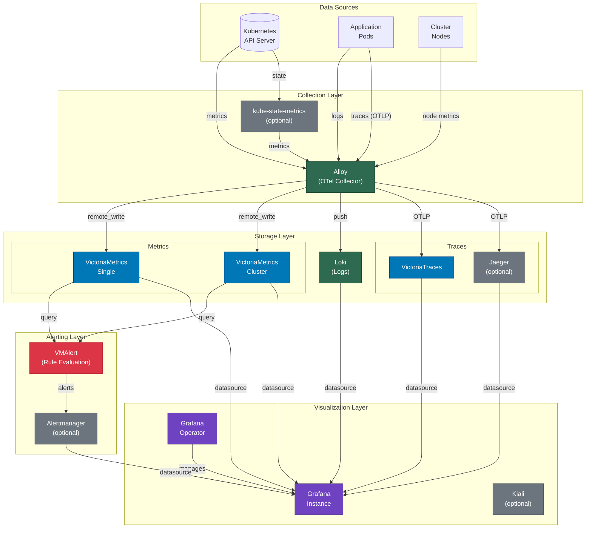
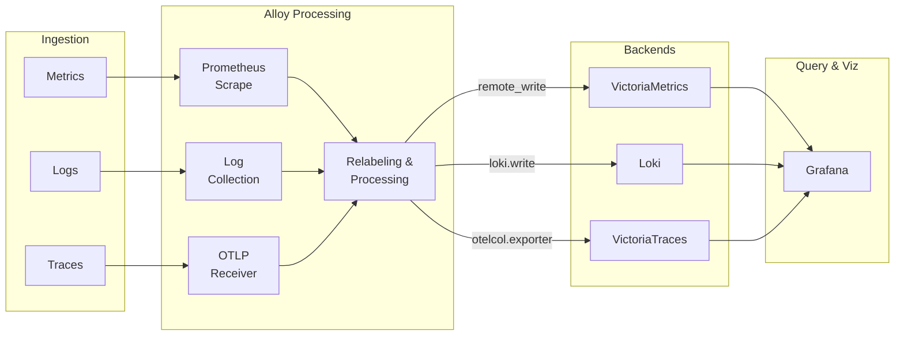
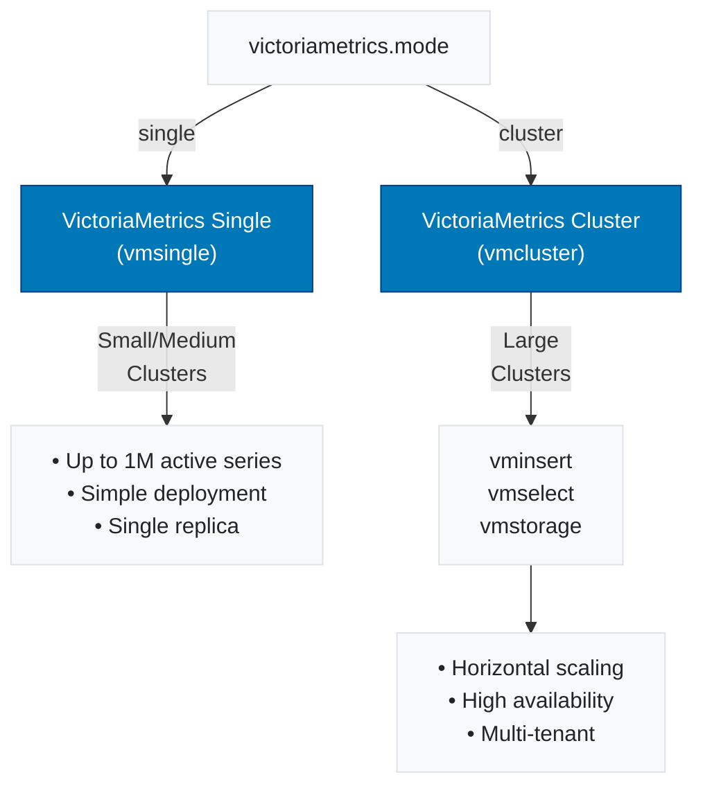
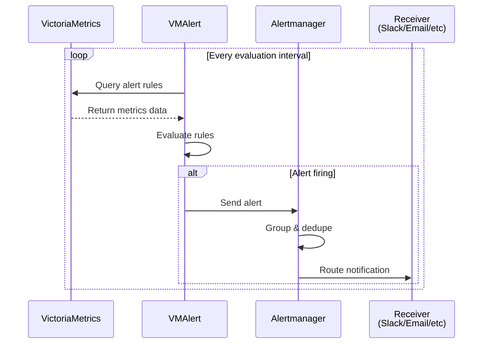
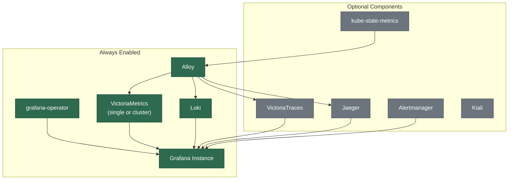

# Architecture

## Component Overview

## Data Flow Diagram

## VictoriaMetrics Mode Selection

## Alert Flow

## Component Dependencies

## Network Ports

| Component | Port | Protocol | Description |
|-----------|------|----------|-------------|
| Grafana | 3000 | HTTP | Web UI |
| VictoriaMetrics Single | 8428 | HTTP | Query/Write API |
| VictoriaMetrics vmselect | 8481 | HTTP | Query API |
| VictoriaMetrics vminsert | 8480 | HTTP | Write API |
| Loki | 3100 | HTTP | Query/Push API |
| Alloy | 12345 | HTTP | UI/Metrics |
| Alloy | 4317 | gRPC | OTLP gRPC |
| Alloy | 4318 | HTTP | OTLP HTTP |
| Alertmanager | 9093 | HTTP | Web UI/API |
| Jaeger Query | 16686 | HTTP | Web UI |
| Kiali | 20001 | HTTP | Web UI |
